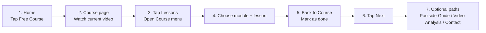

# Freeswimming User Flow Map

## Main User Flow

```mermaid
flowchart TD
  A[Home] --> B[Free Course]
  A --> C[Swim Programs]
  A --> D[Video Analysis]
  A --> E[Our Method]
  A --> F[Contact]

  B --> G[Course Page]
  G --> H[Watch Lesson Video]
  H --> I[Mark as done]
  I --> J[Next lesson]
  J --> H

  G --> K[Lessons button]
  K --> L[Course menu drawer]
  L --> M[Pick module]
  M --> N[Pick lesson]
  N --> H

  L --> O[Main button]
  O --> P[Main menu drawer]
  P --> A
  P --> C
  P --> D
  P --> E
  P --> F

  G --> Q[Poolside Guide]
  G --> R[Video Analysis (Optional)]
  Q --> C
  R --> D
```

## Video Storyboard Flow



## Recommended Labels (Consistency)

- `Lesson X of Y`
- `Module A of B`
- `Current`
- `Mark as done` -> `Done`
- `Lessons` (for course drawer)
- `Main` (for switching from Course menu to main drawer)

## Global vs Contextual Mobile Navigation

- The topbar hamburger is the global menu entry on mobile and desktop, even when a contextual floating nav is present.
- The floating mobile nav is contextual and does not own the global menu:
  - public routes use `Home / Course / Programs`;
  - My Library routine routes use `Library / Micro / Habits`;
  - other My Library routes use `Library / Routines / <current section>`;
  - Admin uses `Home / Library / Dashboard`.
- `Home` is a stable global destination through the logo, drawer, and public floating nav. Do not relabel `Home` as `Back` based on browser history.
- `Back` is reserved for local parent/previous-context links with deterministic fallback.
- Course keeps its learning-flow bottom nav (`Prev` disabled on the first lesson, `Lessons`, `Next` or `Programs`) while the topbar hamburger opens the main menu.

## My Library Authenticated IA

- Signed-in Home places direct `Micro Sessions` and `Habits` actions directly under `Free course`; `Micro Sessions` opens the active weekly micro plan or creation state, with active mobile entries defaulting to the compact `Bubbles` execution surface, and `Habits` opens a compact active-habits view or add-habit state.
- `/my-library`: account home and top-level owner dashboard. On desktop, the hub groups the
  resume/new-content area, member workspaces, owned access, and explore cards into a dashboard
  layout; mobile keeps the same scan-first sequence without the floating mobile nav.
- `/my-library` hides the floating mobile nav so the account hub is scanned through its own cards
  and the header menu remains the global navigation entry; focused My Library subroutes keep their
  contextual mobile nav.
- `/my-library` places one simple `My Routines` row directly under `Free Course`; `Open` goes to `/my-library/routines`.
- `/my-library` top-level cards stay scan-first: `Comparison Report`, `My Swim Profile`, `Goals`, `Swim Sessions`, and `Dryland Sessions` expose one `Open` action, while duplicate `Habits` and top-level `My Training` cards stay out of the landing IA.
- `/my-library/routines`: focused `My Routines` workspace for `Micro Sessions` and `Habits` tabs. `Micro Sessions` `Open` jumps to the full active/setup micro surface, while `Edit` opens micro-plan editing.
- `/my-library/calendar`: private `Comparison Report` period-comparison route for `source`, `period`, `date`, and optional `compareTo` URL params. It is not the future specific calendar grid. The page shows comparison source/period controls first, then the strongest comparison insight, key takeaways, source signals, and detailed numbers. Habits percent comparisons show direct values such as `30% vs 66%` instead of percentage-point wording. Supported filters are `All`, `Habits`, `Micro Sessions`, `Dryland`, and `Swimming`; supported periods are `Week`, `Month`, and `Year`. `Habits` counts existing check-ins/rest/slips/timed minutes through the Habits source contract, including explicit Micro Session Habit credits, reports habit stat reset markers separately, and shows active habit count, included habit names, and tracked days for trust. Reset markers restart motivation stats only; they are not completed habits, rest days, or slips. `Micro Sessions` still counts completed/skipped micro blocks from saved micro-plan history as its own source, `Dryland` currently compares completed saved sessions and training minutes only, and `Swimming` currently shows a not-included-yet state because saved swim sessions do not yet have a canonical completed-on date. Strength sets/reps/load, stretching hold time, and swim-session comparison require explicit future mappings before they are counted. Unknown source or period params fail closed to an unmapped state and do not count as Habits.
- Mobile My Library routine navigation provides direct `Micro` and `Habits` sibling links so users do not need to return through Home or My Library.
- `/my-library/profile`: `My Swim Profile` for swimmer identity, CSS, preferences, personal records, and optional advanced generator limits. The first-use surface opens one recommended setup action instead of expanding every missing section; advanced generator limits stay discoverable but secondary unless they are the selected next action.
- `/my-library/goals`: `Goals` for long-term targets and progress. The surface is action-first: current goals stay in the main list, one filter control switches `Active`/`Achieved`/`Archived`/`All`, `Add goal` owns template/custom creation, and secondary actions such as `Use as focus`, `Add note`, `Archive`, `Restore`, and `Clear best result` live in each goal's `Details`. `Request coaching schedule` stays as one secondary footer CTA to `/contact?source=goals_coaching`.
- `/my-library/training`: contextual training focus/notes route retained for deep links from goals and future session-bound observations; it is not a top-level My Library card.
- `/my-library/habits`: private `My Perfect Day` habit tracker. `Add habit` opens a focused create surface in view on mobile and near the top of the Habits surface on desktop; after `Create habit`, the new row receives focus and shows `Habit added` inside the card. The route supports `date=YYYY-MM-DD` for selected-day Habits history and keeps `view=active` compatible with mobile routine entrypoints. Week controls move by ISO Monday-Sunday weeks, Today returns to the current day, URL/back-forward changes refresh the visible selected day/week, date/week navigation does not add `#today-habits` or jump away from the weekly overview, the selected week shows ISO week number/year plus date range, and the week strip shows weekday/date labels; selected state only reflects loaded data, while requested dates show pending/failure feedback during load or fallback. The Habits heading area shows selected-date context text such as `Today · Jun 6` or `Sat · Jun 6` on the same row as the target count so mobile users can confirm the logging date without opening Weekly Overview or Calendar. Past selected dates allow correcting eligible existing habit check-ins for that date, while `Add habit`, row `Edit this habit`, `End habit and move to Past habits`, and `Restore habit` stay Today-only so historical correction does not accidentally change habit setup. Future dates are not selectable through the UI; upcoming days in the current week are shown as disabled, and invalid/future route dates load Today.

  Add/edit separates cadence period, any-day frequency, and fixed weekdays; rows show labels such as `Daily`, `Weekly - any day`, or `Weekly - 2 fixed days`. User-facing modes are `Do`, `Quit`, and `Timed` while storage keeps the legacy-safe `build`, `quit`, `timed` values. `Do` target setup separates `Done only` / `Any amount` reminders from specific count, duration, time-of-day, and avoid/limit targets; existing specific count units include `times`, `steps`, `pages`, `glasses`, `litres`, and `custom`. Open count rows use one visible `0-100` value stepper plus `Save`; opening `Details` does not duplicate the same value editor. Open `Details` shows one metadata line such as `Daily · Started Jun 7, 2026` and does not repeat setup/status pills such as `Do`, `Open`, `Other`, or `Done only`; Add/Edit owns those setup choices after creation. Desktop habit pills sit after the heading where space allows, and peer row controls keep one visual height so `Save` and `Details` do not overlap. The pre-completion binary action is `Mark done`, completed rows show green `Done` / `Done today` status, row-level `Edit this habit` lives inside `Details` on Today, `End habit and move to Past habits` requires confirmation and moves the habit into `Past habits` without deleting check-ins or reset boundaries, `Restore habit` in `Past habits` requires confirmation and returns the same habit identity to active status, and `Rest day` in details records a non-quit habit as not done, not missed, and excluded from that habit's target for the day.

  A local-only `Completion sound` preference is default off, uses one compact icon-only toggle, previews a soft success chime when enabled, does not show visible `Sound on.` / `Sound off.` helper text for normal toggles, plays only for mapped successful completion transitions or a same-day running timed target crossing, and fails softly if browser audio or localStorage is blocked. `Quit` habits keep `Log slip` in details and, after a slip, show consistency such as `9/10 days clear` plus current streak instead of only resetting to zero days. `Timed` habits show one daily total from separate saved timer seconds, saved manual whole minutes, legacy numeric total when present, and unsaved same-day local timer progress. `Manual time` is an absolute editable value per habit/date, accepts `0`, and saving `5` replaces the manual source instead of adding to a prior `2`; `Finish` saves timer seconds while preserving manual minutes, and starting another timed habit pauses the current local timer. Historical timed corrections use `Manual time`; active timer controls remain Today-only. Weekly/monthly target-met rows stay `Done this week/month` for the rest of the period. Open habits sort by nearest deadline: today/daily first, then `This week`, then `This month`, before low-interruption status, rest-day, and completed groups.

  `Habit stats` appears as a compact, always-open Motivation section after the week calendar before Habits on desktop/tablet and below Habits on mobile so mobile logging remains first. Motivation defaults to `Month`/last 30 days and supports `Week`, `Month`, `3 months`, `6 months`, `Year`, and `All` ranges; `All` is labelled as all time. Current perfect-day streak, best perfect-day streak, perfect days, consistency, rest days, and slips are visible without a `Stats` or `More history` disclosure, while top-level `Timed minutes` and `Count total` stay out of the Motivation summary. Zero-value streaks show `0 days`, and sparse perfect-day/consistency states still show concrete values such as `0/0`, `0/6`, and `0%`. `What counts?` is a full-width disclosure explaining that Perfect days are days where every habit scheduled for that day was completed, Perfect-day streak is consecutive perfect days, Best perfect-day streak is the longest streak in the selected period, Consistency is the percent of days in range that were perfect days, `0/0` means no scheduled Perfect Day habits existed in the selected period, Rest days are intentional skips excluded from that habit's target for the day, Slips are logged misses for Quit habits, and `Reset habit stats` restarts motivation stats from the selected reset date without deleting earlier check-ins. `Past habits` stays full width below `What counts?` and exposes `Restore habit` on Today only; permanent delete is not part of this flow.

  The Habits action row keeps `Add habit` primary and exposes compact `Weekly Overview`, `Motivation`, and `Sound` icon controls; mobile active view also keeps the Habits analysis shortcut. Each active habit's own current/best streak, days completed, consistency, and optional `Reset habit stats` action live inside that habit's `Details` using the active Motivation range. `Reset habit stats` creates a dated server-canonical reset boundary, restarts derived motivation stats from that selected date, shows `Last stats restart <date>` in Details, and points complete history to Calendar Comparison. Timed habit cards keep source details such as timer/manual/active timer inside `Details` instead of collapsed row pills. Closed habit cards show the strongest lightweight motivation prompt, such as the active streak in cadence units, completed days, or a start-streak prompt when the streak is zero. Unknown future check-in or reset statuses fail closed and do not improve streak or consistency. Shared week/month/year comparison lives on `/my-library/calendar`; mobile active Habits links to it with `/my-library/calendar?source=habits&period=week&date=<selectedDate>`, and work/off-work belongs to future context filters, not a separate calendar.

- `/my-library/workouts`: `My Swim Sessions` for saved swim sessions plus `Build pool session`, `Build open water session`, and `AI session generator`.
- `/my-library/dryland`: `Dryland Sessions` for saved strength/stretching work, dryland creation, and compact weekly `Micro Sessions` execution. The default route shows create actions and saved-session `Edit`/`Open`/`Delete` rows before the full Micro Session panel; micro-focused query states still prioritize the Micro Session surface. Micro Session source checkboxes appear only inside explicit create/edit mode, source rows keep direct `Edit` links, and edit mode stays configuration-only while execution actions remain in the normal open view. Users complete open units with `Done`, timed `Bubbles` units can run a lightweight in-bubble countdown that auto-completes at zero, early completion uses `Complete?` confirmation and resumes countdown after about one second if unconfirmed, unfinished units stay open, grouped completed/skipped history summarizes repeated exercise units, Bubble mode exposes direct `Edit`, `Clear`, and icon-only sound controls on one row instead of a `Manage micro session` accordion, normal active plans do not offer a visible `Pause` action, already-paused Micro Session plans still show `Resume`, `Clear` handles stale or irrelevant weekly plans with confirmation, and `Update current micro session` is only for deliberately rebuilding remaining queued units after saved-session edits. Active Micro Sessions can explicitly use `Make recurring habit` to create one linked weekly build Habit with name and start date; the linked Habit auto-completes when every non-archived unit in the week's Micro Session is completed, `skipped` units do not count, and undo removes only the auto-generated Micro Session Habit credit for that plan/week. Linked status shows `Weekly program`, `Pause habit`, or `Resume habit`. Pausing the Habit link keeps bubbles executable but prevents Habit credit and habit-driven weekly renewal; resuming after a stale paused week may create the current week's bubbles from the same source sessions without backfilling missed weeks. A separate local-only Micro Sessions sound preference is default off and icon-only; enabling it previews the tap sound, server-confirmed reps/tap completions use a short tap profile, duration/timer bubble completions use a distinct timer profile, and failed saves, undo/restore, page load, hydration, skipped/unfinished units, and clearing the plan do not play sound.
- `/my-library/programs/<id>`: `Program builder` for optional week/day planning from saved swim sessions.
