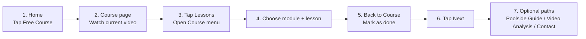

# Freeswimming User Flow Map

## Main User Flow

```mermaid
flowchart TD
  A[Home] --> B[Free Course]
  A --> C[Swim Programs]
  A --> D[Video Analysis]
  A --> E[Our Method]
  A --> F[Contact]

  B --> G[Course Page]
  G --> H[Watch Lesson Video]
  H --> I[Mark as done]
  I --> J[Next lesson]
  J --> H

  G --> K[Lessons button]
  K --> L[Course menu drawer]
  L --> M[Pick module]
  M --> N[Pick lesson]
  N --> H

  L --> O[Menu button]
  O --> P[Main menu drawer]
  P --> A
  P --> C
  P --> D
  P --> E
  P --> F

  G --> Q[Poolside Guide]
  G --> R[Video Analysis (Optional)]
  Q --> C
  R --> D
```

## Video Storyboard Flow



## Recommended Labels (Consistency)

- `Lesson X of Y`
- `Module A of B`
- `Current`
- `Mark as done` -> `Done`
- `Lessons` (for course drawer)
- `Menu` (for main drawer)

## My Library Authenticated IA

- `/my-library`: account home and top-level owner dashboard.
- `/my-library` places a compact `Today` window directly under `Free Course`; `Today` has `Bubbles` and `Habits` tabs, while `Perfect Day` remains a habit progress status rather than a separate route/tab.
- `/my-library` top-level cards stay scan-first: `Swim Sessions` and `Dryland Sessions` expose one `Open` action, while creation actions live inside their dedicated hub routes.
- `/my-library/profile`: `My Swim Profile` for swimmer identity, CSS, preferences, and personal records.
- `/my-library/goals`: `Goals` for long-term targets and progress.
- `/my-library/training`: `My Training` for turning goals into focus cues and notes.
- `/my-library/workouts`: `My Swim Sessions` for saved swim sessions plus `Build pool session`, `Build open water session`, and `AI session generator`.
- `/my-library/dryland`: `Dryland Sessions` for saved strength/stretching work, dryland creation, and weekly `Micro Sessions` exercise-block completion.
- `/my-library/programs/<id>`: `Program builder preview` for optional week/day planning from saved swim sessions.
