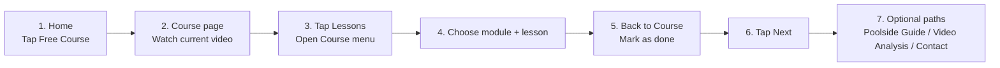

# Freeswimming User Flow Map

## Main User Flow

```mermaid
flowchart TD
  A[Home] --> B[Free Course]
  A --> C[Swim Programs]
  A --> D[Video Analysis]
  A --> E[Our Method]
  A --> F[Contact]

  B --> G[Course Page]
  G --> H[Watch Lesson Video]
  H --> I[Mark as done]
  I --> J[Next lesson]
  J --> H

  G --> K[Lessons button]
  K --> L[Course menu drawer]
  L --> M[Pick module]
  M --> N[Pick lesson]
  N --> H

  L --> O[Main button]
  O --> P[Main menu drawer]
  P --> A
  P --> C
  P --> D
  P --> E
  P --> F

  G --> Q[Poolside Guide]
  G --> R[Video Analysis (Optional)]
  Q --> C
  R --> D
```

## Video Storyboard Flow



## Recommended Labels (Consistency)

- `Lesson X of Y`
- `Module A of B`
- `Current`
- `Mark as done` -> `Done`
- `Lessons` (for course drawer)
- `Main` (for switching from Course menu to main drawer)

## Global vs Contextual Mobile Navigation

- The topbar hamburger is the global menu entry on mobile and desktop, even when a contextual floating nav is present.
- The floating mobile nav is contextual and does not own the global menu:
  - public routes use `Home / Course / Programs`;
  - My Library routine routes use `Library / Micro / Habits`;
  - other My Library routes use `Library / Routines / <current section>`;
  - Admin uses `Home / Library / Dashboard`.
- `Home` is a stable global destination through the logo, drawer, and public floating nav. Do not relabel `Home` as `Back` based on browser history.
- `Back` is reserved for local parent/previous-context links with deterministic fallback.
- Course keeps its learning-flow bottom nav (`Prev` disabled on the first lesson, `Lessons`, `Next` or `Programs`) while the topbar hamburger opens the main menu.

## My Library Authenticated IA

- Signed-in Home places direct `Micro Sessions` and `Habits` actions directly under `Free course`; `Micro Sessions` opens the active weekly micro plan or creation state, with active mobile entries defaulting to the compact `Bubbles` execution surface, and `Habits` opens a compact active-habits view or add-habit state.
- `/my-library`: account home and top-level owner dashboard.
- `/my-library` hides the floating mobile nav so the account hub is scanned through its own cards
  and the header menu remains the global navigation entry; focused My Library subroutes keep their
  contextual mobile nav.
- `/my-library` places one simple `My Routines` row directly under `Free Course`; `Open` goes to `/my-library/routines`.
- `/my-library` top-level cards stay scan-first: `My Swim Profile`, `Goals`, `Swim Sessions`, and `Dryland Sessions` expose one `Open` action, while duplicate `Habits` and top-level `My Training` cards stay out of the landing IA.
- `/my-library/routines`: focused `My Routines` workspace for `Micro Sessions` and `Habits` tabs. `Micro Sessions` `Open` jumps to the full active/setup micro surface, while `Edit` opens micro-plan editing.
- Mobile My Library routine navigation provides direct `Micro` and `Habits` sibling links so users do not need to return through Home or My Library.
- `/my-library/profile`: `My Swim Profile` for swimmer identity, CSS, preferences, personal records, and optional advanced generator limits. The first-use surface opens one recommended setup action instead of expanding every missing section; advanced generator limits stay discoverable but secondary unless they are the selected next action.
- `/my-library/goals`: `Goals` for long-term targets and progress. The surface is action-first: current goals stay in the main list, one filter control switches `Active`/`Achieved`/`Archived`/`All`, `Add goal` owns template/custom creation, and secondary actions such as `Use as focus`, `Add note`, `Archive`, `Restore`, and `Clear best result` live in each goal's `Details`. `Request coaching schedule` stays as one secondary footer CTA to `/contact?source=goals_coaching`.
- `/my-library/training`: contextual training focus/notes route retained for deep links from goals and future session-bound observations; it is not a top-level My Library card.
- `/my-library/habits`: private `My Perfect Day` habit tracker. `Add habit` opens a focused create surface in view on mobile and near the top of the Habits surface on desktop; after `Create habit`, the new row receives focus and shows `Habit added` inside the card. Add/edit separates cadence period, any-day frequency, and fixed weekdays; rows show labels such as `Daily`, `Weekly - any day`, or `Weekly - 2 fixed days`. User-facing modes are `Build`, `Quit`, and `Timed` while storage keeps the legacy-safe `build`, `quit`, `timed` values. `Build` habits support no-quantity `Done only` check-ins plus count/time variants; the pre-completion binary action is `Mark done`, completed rows show green `Done` / `Done today` status, row-level `Edit` lives inside `Details`, `Quit` habits keep `Log slip` in details, and `Timed` habits restore same-day local timer progress after browser/PWA restart without writing server completion automatically. Open habits sort by nearest deadline: today/daily first, then `This week`, then `This month`, before low-interruption status and completed groups.
- `/my-library/workouts`: `My Swim Sessions` for saved swim sessions plus `Build pool session`, `Build open water session`, and `AI session generator`.
- `/my-library/dryland`: `Dryland Sessions` for saved strength/stretching work, dryland creation, and compact weekly `Micro Sessions` execution. The default route shows create actions and saved-session `Edit`/`Open`/`Delete` rows before the full Micro Session panel; micro-focused query states still prioritize the Micro Session surface. Micro Session source checkboxes appear only inside explicit create/edit mode, source rows keep direct `Edit` links, and edit mode stays configuration-only while execution actions remain in the normal open view. Users complete open units with `Done`, timed `Bubbles` units can run a lightweight in-bubble countdown that auto-completes at zero, early completion uses `Complete?` confirmation and resumes countdown after about one second if unconfirmed, unfinished units stay open, grouped completed/skipped history summarizes repeated exercise units, `Clear micro session` handles stale or irrelevant weekly plans, and `Update current micro session` is only for deliberately rebuilding remaining queued units after saved-session edits.
- `/my-library/programs/<id>`: `Program builder` for optional week/day planning from saved swim sessions.
