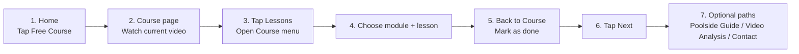

# Freeswimming User Flow Map

## Main User Flow

```mermaid
flowchart TD
  A[Home] --> B[Free Course]
  A --> C[Swim Programs]
  A --> D[Video Analysis]
  A --> E[Our Method]
  A --> F[Contact]

  B --> G[Course Page]
  G --> H[Watch Lesson Video]
  H --> I[Mark as done]
  I --> J[Next lesson]
  J --> H

  G --> K[Lessons button]
  K --> L[Course menu drawer]
  L --> M[Pick module]
  M --> N[Pick lesson]
  N --> H

  L --> O[Menu button]
  O --> P[Main menu drawer]
  P --> A
  P --> C
  P --> D
  P --> E
  P --> F

  G --> Q[Poolside Guide]
  G --> R[Video Analysis (Optional)]
  Q --> C
  R --> D
```

## Video Storyboard Flow



## Recommended Labels (Consistency)

- `Lesson X of Y`
- `Module A of B`
- `Current`
- `Mark as done` -> `Done`
- `Lessons` (for course drawer)
- `Menu` (for main drawer)

## My Library Authenticated IA

- Signed-in Home places direct `Micro Sessions` and `Habits` actions directly under `Free course`; `Micro Sessions` opens the active weekly micro plan or creation state, with active mobile entries defaulting to the compact `Bubbles` execution surface, and `Habits` opens a compact active-habits view or add-habit state.
- `/my-library`: account home and top-level owner dashboard.
- `/my-library` places one simple `My Routines` row directly under `Free Course`; `Open` goes to `/my-library/routines`.
- `/my-library` top-level cards stay scan-first: `My Swim Profile`, `Goals`, `Swim Sessions`, and `Dryland Sessions` expose one `Open` action, while duplicate `Habits` and top-level `My Training` cards stay out of the landing IA.
- `/my-library/routines`: focused `My Routines` workspace for `Micro Sessions` and `Habits` tabs with `Open` and `Edit` actions.
- `/my-library/profile`: `My Swim Profile` for swimmer identity, CSS, preferences, and personal records.
- `/my-library/goals`: `Goals` for long-term targets and progress.
- `/my-library/training`: contextual training focus/notes route retained for deep links from goals and future session-bound observations; it is not a top-level My Library card.
- `/my-library/habits`: private `My Perfect Day` habit tracker. Rows show habit cadence (`Daily`, `Weekly`, or days/week); `Build` habits use quick `Done`/`Undo` check-ins, `Quit` habits use days-since plus explicit `Log slip` in details, and `Timed` habits show daily timer progress such as `0:00 / 8:00 today` while the summary cards remain 7-day rollups.
- `/my-library/workouts`: `My Swim Sessions` for saved swim sessions plus `Build pool session`, `Build open water session`, and `AI session generator`.
- `/my-library/dryland`: `Dryland Sessions` for saved strength/stretching work, dryland creation, and compact weekly `Micro Sessions` execution. Saved-session `Edit`/`Open`/`Delete` rows are the default; Micro Session source checkboxes appear only inside explicit create/edit mode, source rows keep direct `Edit` links, and edit mode stays configuration-only while execution actions remain in the normal open view. Users complete open units with `Done`, leave unfinished units open, use `Clear micro session` for stale or irrelevant weekly plans, and use `Update current micro session` only when saved-session edits should rebuild remaining queued units in the active plan.
- `/my-library/programs/<id>`: `Program builder preview` for optional week/day planning from saved swim sessions.
